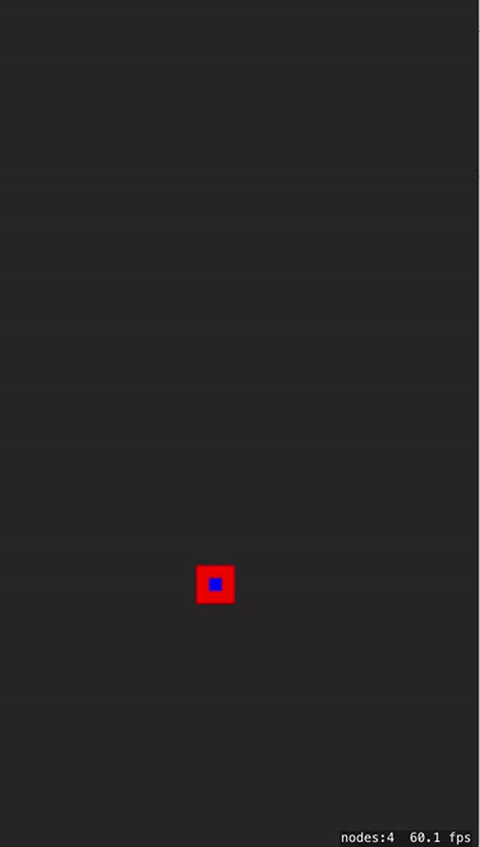

# Grappling-Hook-3

This example suggests a possible solution to creating a grappling hook effect. This example uses update to move the hook 
and the character. See the comments in this example for insights on how this works. 

